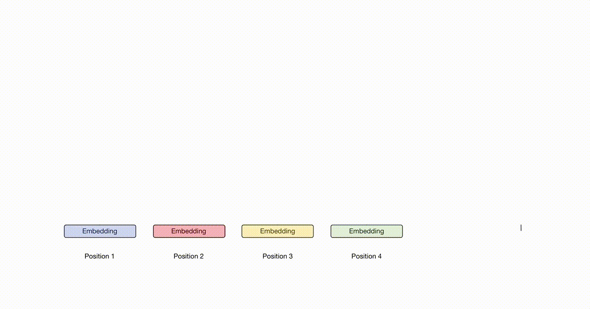

# Universal-Transformer-Pytorch
Simple and self-contained implementation of the [Universal Transformer](https://arxiv.org/abs/1807.03819) (Dehghani, 2018) in Pytorch. Please open issues if you find bugs, and send pull request if you want to contribuite. 


GIF taken from: [https://twitter.com/OriolVinyalsML/status/1017523208059260929](https://twitter.com/OriolVinyalsML/status/1017523208059260929)

## Universal Transformer 
The basic Transformer model has been taken from [https://github.com/kolloldas/torchnlp](https://github.com/kolloldas/torchnlp). For now it has been implemented:

- Universal Transformer Encoder Decoder, with position and time embeddings.
- [Adaptive Computation Time](https://arxiv.org/abs/1603.08983) (Graves, 2016) as describe in Universal Transformer paper. 
- Universal Transformer for bAbI data.  
 
## Dependendency
```
python3
pytorch 0.4
torchtext
argparse
```
## How to run
To run standard Universal Transformer on bAbI run:
```
python main.py --task 1
```
To run Adaptive Computation Time: 
```
python main.py --task 1 --act
```

## Results
10k over 10 run, get the maximum.

In task 16 17 18 19 I notice that are very hard to converge also in training set. 
The problem seams to be the lr rate scheduling. Moreover, on 1K setting the results
are very bad yet, maybe I have to tune some hyper-parameters. 

|Task  | Uni-Trs| + ACT  | Original |
|  --- |---     |---     |---       |     
|  1   | 0.0    |  0.0   | 0.0      |
|  2   | 0.0    |  0.2   | 0.0      |
|  3   | 0.8    |  2.4   | 0.4      |
|  4   | 0.0    |  0.0   | 0.0      |
|  5   | 0.4    |  0.1   | 0.0      |
|  6   | 0.0    |  0.0   | 0.0      |
|  7   | 0.4    |  0.0   | 0.0      |
|  8   | 0.2    |  0.1   |  0.0     |
|  9   | 0.0    |  0.0   |  0.0     |
| 10   | 0.0    |  0.0   |  0.0     |
| 11   | 0.0    |  0.0   |  0.0     |
| 12   | 0.0    |  0.0   |  0.0     |
| 13   | 0.0    |  0.0   |  0.0     |
| 14   | 0.0    |  0.0   |  0.0     |
| 15   | 0.0    |  0.0   |  0.0     |
| 16   | 50.5   |  50.6  |  0.4     |
| 17   | 13.7   |  14.1  |  0.6     |
| 18   | 4      |    6.9 |  0.0     |
| 19   | 79.2   |  65.2  |  2.8     |
| 20   | 0.0    |  0.0   |  0.0     |
|---   | ---    | ---    |  ---     |
| avg  | 7.46   | 6.98   |  0.21    |
| fail | 3      | 3      |  0       |

## TODO
- Visualize ACT on different tasks 

<!-- Noam True ACT False Task: 1 Max:  Mean: 1.0 Std: 0.0
Noam True ACT False Task: 2 Max:  Mean: 0.9858 Std: 0.028480870773204943
Noam True ACT False Task: 3 Max:  Mean: 0.9186 Std: 0.13648604324252353
Noam True ACT False Task: 4 Max:  Mean: 1.0 Std: 0.0
Noam True ACT False Task: 5 Max:  Mean: 0.9423 Std: 0.07518384134905584
Noam True ACT False Task: 6 Max:  Mean: 0.9991 Std: 0.0009433981132056612
Noam True ACT False Task: 7 Max:  Mean: 0.9613999999999999 Std: 0.03378816360798555
Noam True ACT False Task: 8 Max:  Mean: 0.9959 Std: 0.0022113344387495997
Noam True ACT False Task: 9 Max:  Mean: 0.998 Std: 0.0022360679774997916
Noam True ACT False Task: 10 Max:  Mean: 0.9972 Std: 0.002600000000000002
Noam True ACT False Task: 11 Max:  Mean: 0.9994 Std: 0.001200000000000001
Noam True ACT False Task: 12 Max:  Mean: 0.9998000000000001 Std: 0.0006000000000000005
Noam True ACT False Task: 13 Max:  Mean: 0.982 Std: 0.025791471458604318
Noam True ACT False Task: 14 Max:  Mean: 0.9983000000000001 Std: 0.0019519221295943153
Noam True ACT False Task: 15 Max:  Mean: 0.999 Std: 0.0024083189157584613
Noam True ACT False Task: 16 Max:  Mean: 0.47669999999999996 Std: 0.014262187770464941
Noam True ACT False Task: 17 Max:  Mean: 0.6883999999999999 Std: 0.10602754359127634
Noam True ACT False Task: 18 Max:  Mean: 0.9126 Std: 0.01696584804835878
Noam True ACT False Task: 19 Max:  Mean: 0.1639 Std: 0.03415098827266936
Noam True ACT False Task: 20 Max:  Mean: 1.0 Std: 0.0 -->
<!-- Noam True ACT True Task: 1 Max:  Mean: 0.9996 Std: 0.0009165151389911689
Noam True ACT True Task: 2 Max:  Mean: 0.9572999999999998 Std: 0.050034088379823614
Noam True ACT True Task: 3 Max:  Mean: 0.8862999999999998 Std: 0.13403883765536015
Noam True ACT True Task: 4 Max:  Mean: 0.9999 Std: 0.0003000000000000003
Noam True ACT True Task: 5 Max:  Mean: 0.9743999999999999 Std: 0.051252707245569
Noam True ACT True Task: 6 Max:  Mean: 0.9921 Std: 0.02072414051293803
Noam True ACT True Task: 7 Max:  Mean: 0.9515 Std: 0.032696330069290645
Noam True ACT True Task: 8 Max:  Mean: 0.9957 Std: 0.0018466185312619402
Noam True ACT True Task: 9 Max:  Mean: 0.9991 Std: 0.0013747727084867532
Noam True ACT True Task: 10 Max:  Mean: 0.9986 Std: 0.002653299832284322
Noam True ACT True Task: 11 Max:  Mean: 0.9987 Std: 0.0019519221295943153
Noam True ACT True Task: 12 Max:  Mean: 0.9999 Std: 0.00030000000000000024
Noam True ACT True Task: 13 Max:  Mean: 0.9991 Std: 0.0015132745950421568
Noam True ACT True Task: 14 Max:  Mean: 0.9926 Std: 0.01517366139071254
Noam True ACT True Task: 15 Max:  Mean: 1.0 Std: 0.0
Noam True ACT True Task: 16 Max:  Mean: 0.487 Std: 0.005440588203494182
Noam True ACT True Task: 17 Max:  Mean: 0.7247 Std: 0.10200691153054287
Noam True ACT True Task: 18 Max:  Mean: 0.9086000000000001 Std: 0.01060377291344926
Noam True ACT True Task: 19 Max:  Mean: 0.2424 Std: 0.04844625888549083
Noam True ACT True Task: 20 Max:  Mean: 0.9996 Std: 0.000489897948556636 -->
